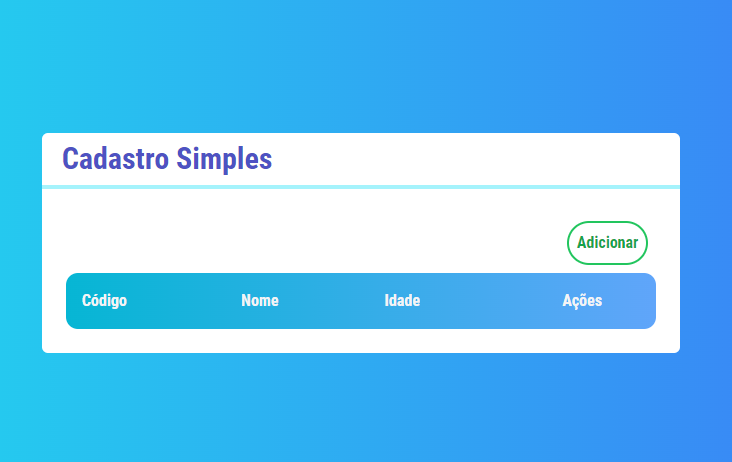
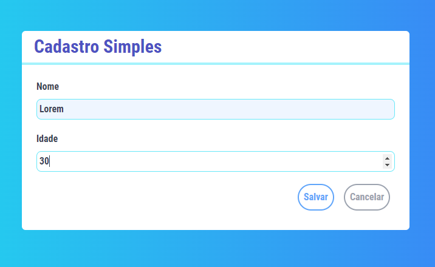
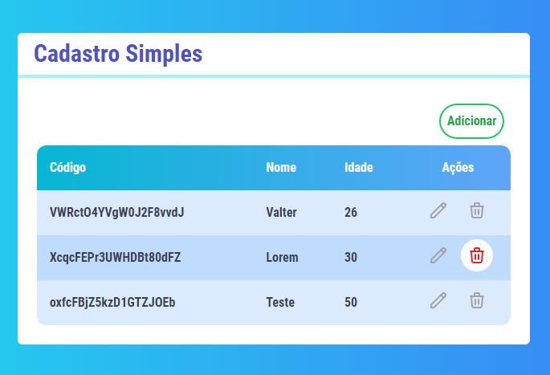

<h1 align="center">Cadastro Simples </h1>

 🚀 Estudo de React, NextJS, FireBase, Tailwindcss 

<h1 align="center"></h1>

•
 <a href="#objetivo">Objetivo</a> •
 <a href="#tecnologias">Tecnologias</a> • 
 <a href="#autor">Autor</a> •

<h1 align="center">
    
    
    
</h1>

## **Objetivo**

 🔍 Estudando Next - primeira aplicação com as ferramentas 

## **Tecnologias**

<ul>

<li>🛠 React
<li>🛠 NextJS
<li>🛠 FireBase
<li>🛠 Tailwindcss

</ul>

## **Autor**

 Desenvolvido por <a href="https://github.com/valtercfjunior">Valter Junior</a> 

 Créditos: <a href="https://www.cod3r.com.br/">Cod3r</a> 
